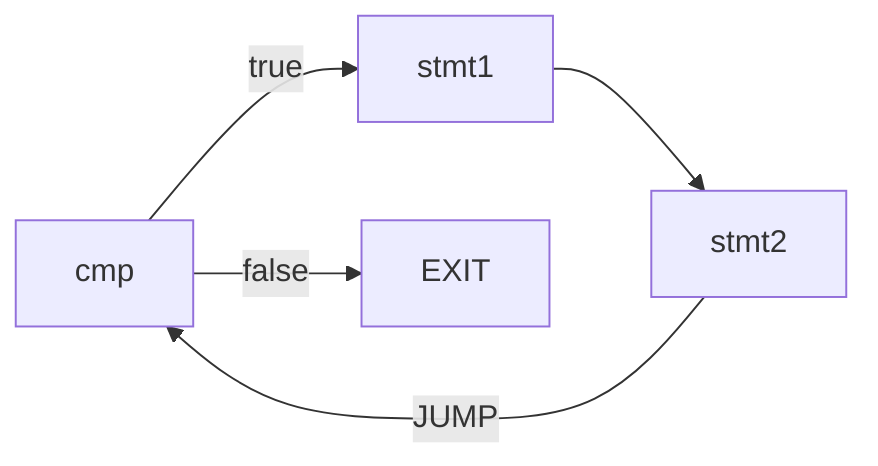
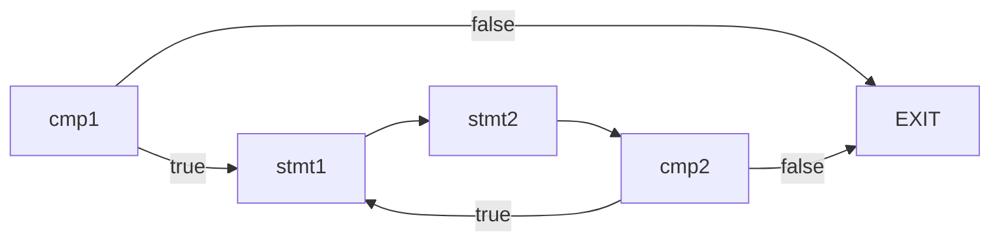

使用 C++ 语言设计并实现支持精简 C 文法的编译器

项目链接 https://github.com/yspjack/compiler-design

<!--more-->

# 词法

| 单词名称 	| 类别码   	|
|----------	|----------	|
| 标识符   	| IDENFR   	|
| 整型常量 	| INTCON   	|
| 字符常量 	| CHARCON  	|
| 字符串   	| STRCON   	|
| `const`    	| CONSTTK  	|
| `int`      	| INTTK    	|
| `char`     	| CHARTK   	|
| `void`     	| VOIDTK   	|
| `main`     	| MAINTK   	|
| `if`       	| IFTK     	|
| `else`     	| ELSETK   	|
| `do`       	| DOTK     	|
| `while`    	| WHILETK  	|
| `for`      	| FORTK    	|
| `scanf`    	| SCANFTK  	|
| `printf`   	| PRINTFTK 	|
| `return`   	| RETURNTK 	|
| `+`        	| PLUS     	|
| `-`        	| MINU     	|
| `*`        	| MULT     	|
| `/`        	| DIV      	|
| `<`        	| LSS      	|
| `<=`       	| LEQ      	|
| `>`        	| GRE      	|
| `>=`       	| GEQ      	|
| `==`       	| EQL      	|
| `!=`       	| NEQ      	|
| `=`        	| ASSIGN   	|
| `;`        	| SEMICN   	|
| `,`        	| COMMA    	|
| `(`        	| LPARENT  	|
| `)`        	| RPARENT  	|
| `[`        	| LBRACK   	|
| `]`        	| RBRACK   	|
| `{`        	| LBRACE   	|
| `}`        	| RBRACE   	|

# 文法分析

基于递归下降的 LL(k) 文法分析

## 文法

```
＜加法运算符＞ ::= +｜-
＜乘法运算符＞  ::= *｜/
＜关系运算符＞  ::=  <｜<=｜>｜>=｜!=｜==
＜字母＞   ::= ＿｜a｜．．．｜z｜A｜．．．｜Z
＜数字＞   ::= ０｜＜非零数字＞
＜非零数字＞  ::= １｜．．．｜９
＜字符＞    ::=  '＜加法运算符＞'｜'＜乘法运算符＞'｜'＜字母＞'｜'＜数字＞'
＜字符串＞   ::=  "{十进制编码为32,33,35-126的ASCII字符｝"

＜程序＞    ::= [＜常量说明＞][＜变量说明＞]{＜有返回值函数定义＞|＜无返回值函数定义＞}＜主函数＞

＜常量说明＞ ::=  const＜常量定义＞;{ const＜常量定义＞;}
＜常量定义＞   ::=   int＜标识符＞=＜整数＞{,＜标识符＞=＜整数＞}
                  | char＜标识符＞=＜字符＞{,＜标识符＞=＜字符＞}
＜无符号整数＞  ::= ＜非零数字＞{＜数字＞｝| 0
＜整数＞        ::= [＋｜－]＜无符号整数＞
＜标识符＞    ::=  ＜字母＞{＜字母＞｜＜数字＞｝

＜声明头部＞   ::=  int＜标识符＞ |char＜标识符＞

＜变量说明＞  ::= ＜变量定义＞;{＜变量定义＞;}
＜变量定义＞  ::= ＜类型标识符＞(＜标识符＞|＜标识符＞'['＜无符号整数＞']'){,(＜标识符＞|＜标识符＞'['＜无符号整数＞']' )} 
                 //＜无符号整数＞表示数组元素的个数，其值需大于0
＜类型标识符＞      ::=  int | char

＜有返回值函数定义＞  ::=  ＜声明头部＞'('＜参数表＞')' '{'＜复合语句＞'}'
＜无返回值函数定义＞  ::= void＜标识符＞'('＜参数表＞')''{'＜复合语句＞'}'
＜复合语句＞   ::=  [＜常量说明＞][＜变量说明＞] ＜语句列＞
＜参数表＞    ::=  ＜类型标识符＞＜标识符＞{,＜类型标识符＞＜标识符＞}| ＜空＞
＜主函数＞    ::= void main‘(’‘)’ ‘{’＜复合语句＞‘}’

＜表达式＞    ::= [＋｜－]＜项＞{＜加法运算符＞＜项＞}
＜项＞     ::= ＜因子＞{＜乘法运算符＞＜因子＞}
＜因子＞    ::= ＜标识符＞｜＜标识符＞'['＜表达式＞']'|'('＜表达式＞')'｜＜整数＞|＜字符＞｜＜有返回值函数调用语句＞         
＜语句＞    ::= ＜条件语句＞｜＜循环语句＞| '{'＜语句列＞'}'| ＜有返回值函数调用语句＞; 
                           |＜无返回值函数调用语句＞;｜＜赋值语句＞;｜＜读语句＞;｜＜写语句＞;｜＜空＞;|＜返回语句＞;
＜赋值语句＞   ::=  ＜标识符＞=＜表达式＞|＜标识符＞'['＜表达式＞']'=＜表达式＞
＜条件语句＞  ::= if '('＜条件＞')'＜语句＞[else＜语句＞]
＜条件＞    ::=  ＜表达式＞＜关系运算符＞＜表达式＞｜＜表达式＞
＜循环语句＞   ::=  while '('＜条件＞')'＜语句＞| do＜语句＞while '('＜条件＞')' |for'('＜标识符＞=＜表达式＞;＜条件＞;＜标识符＞=＜标识符＞(+|-)＜步长＞')'＜语句＞
＜步长＞::= ＜无符号整数＞  
＜有返回值函数调用语句＞ ::= ＜标识符＞'('＜值参数表＞')'
＜无返回值函数调用语句＞ ::= ＜标识符＞'('＜值参数表＞')'
＜值参数表＞   ::= ＜表达式＞{,＜表达式＞}｜＜空＞
＜语句列＞   ::= {＜语句＞｝
＜读语句＞    ::=  scanf '('＜标识符＞{,＜标识符＞}')'
＜写语句＞    ::= printf '(' ＜字符串＞,＜表达式＞ ')'| printf '('＜字符串＞ ')'| printf '('＜表达式＞')'
＜返回语句＞   ::=  return['('＜表达式＞')']    
```

# 中间代码

四元组：（运算符，左操作数，右操作数，结果）


### 函数声明

源码形如：

`int foo( int a, int b, int c, int d)`

中间代码：

```
int foo()
para int a
para int b
para int c
para int d
```

### 函数调用

源码形如：

 `i = tar(x,y)`

中间代码：

```
push x
push y
call tar
i = RET
```

### 函数返回

源码形如：

`return (x)`

中间代码：

`ret x`

### 变量声明

源码形如：

`int i, j;`

中间代码（符号表信息输出，程序中可不生成真正的中间代码）：

```
var int i
var int j
```

### 常数声明

源码形如：

 `const int c = 10`

中间代码（符号表信息输出，程序中可不生成真正的中间代码）：

 `const int c = 10`

### 表达式

源码形如：

`x = a * (b + c)`

中间代码（可优化）：
```
t1 = b + c
t2 = a * t1
x = t2
```
### 条件判断

源码形如：

`x == y`

中间代码：

`x == y`

### 条件或无条件跳转

中间代码：

```
GOTO LABEL1 //无条件跳转到LABEL1
BNZ LABEL1 //满足条件跳转到LABEL1
BZ LABEL1 //不满足条件跳转到LABEL1
```

### 带标号语句

中间代码：
```
Label_1 :
x = a + b
```

### 数组赋值或取值

源码形如：

`a[i] = b * c[j]`

中间代码：

```
t1 = c[j]
t2 = b * t1
a[i] = t2
```

其他本文档未涉及到的语法现象，或者程序员自行定义的四元式操作，原则上均按照“x = y op z”形式的中缀表达式进行表达。

# 符号表

# 优化

## 竞速排名要求

竞速排名根据程序运行后的统计信息，加权计算后排名。按照 `ALU` 权重 1， `Jump/Branch` 权重 2， `Memory` 权重 2， `Others` 权重 1 的比例计算后，得到 `FinalCycle = ALU * 1 + Jump * 2 + Branch * 2 + Memory * 2 + Other * 1` 进行排名。在运行正确的前提下， `FinalCycle` 越小排名越靠前。

## 优化策略

### 循环优化

这里感谢 游子诺 同学在讨论区分享优化方法。

以while循环为例，假设循环次数为N。

优化前，每次执行循环体语句之前判断是否满足条件，执行完循环体再跳回条件判断。

不考虑循环体语句，执行循环的分支语句为N，跳转语句为N





优化后，循环开头先判断一次条件，不满足则跳转到循环结束。循环内语句执行完毕后，判断是否满足循环条件，如果满足则跳转到循环体第1条语句，否则跳转到循环结束。

不考虑循环体语句，执行循环的分支语句为N+1，跳转语句为0。优化后，执行循环的代价降低。




### 基本块划分

笔者采用以下划分基本块的标志：

- 语句序列开头
- 紧跟跳转、分支指令之后的指令
- 由跳转、分支转移到的第一条指令
- 紧跟函数调用之后的指令

将函数调用也作为划分标志的原因：

后面分配临时寄存器，分配到临时寄存器的临时变量不用保存到内存。

但是，这样做会产生跨基本块的临时变量。对于这些变量，不分配寄存器。

### 局部公共子表达式消除

由于从DAG图导出代码，书上的启发式算法只考虑了表达式，没有对IO指令、数组访问、函数调用、传参等特殊情况给出实现建议。
存在多个中间节点时，按照启发式算法可以任意选择中间节点，但是不能保证导出的代码仍然遵循原来的顺序，导致IO指令、数组访问、函数调用、传参等特殊情况出错。

因此，笔者不使用DAG算法。从全局公共子表达式消除算法受到启发，笔者采用以下方法消除局部公共子表达式:

给定基本块内四元式：$s:t \leftarrow x \oplus y$，寻找满足以下条件的四元式 $n:v \leftarrow x \oplus y$ : 从n到s的路径上，既没有计算 $x \oplus y$, 也没有对v,x,y定值。

如果找到这样的四元式 $n:v \leftarrow x \oplus y$ ，那么将 $s:t \leftarrow x \oplus y$ 替换为 $s:t \leftarrow v$

### 算术优化

对于算术运算，判断两边是否都为常数，如果为常数，则生成li伪指令。

对于加法，判断其中一边是否为常数，如果为常数，使用addi指令（或伪指令）。

对于乘法、除法，如果运算数包含2的整数次幂，则使用移位指令(sll, sra)代替，可以减少一条指令。

对于形如`x-x/y*y`的代码，生成汇编时用以下指令进行替代。
假设x,y的值分别保存在t1,t2

```
div $t1, $t2
mfhi $t0
```

另外，通过阅读mars源代码，笔者发现对于 `div t1,t2,t3` 这样的除法伪指令，
mars会生成以下代码，先判断被除数是否为0再进行除法
```asm
bne $t3, $0, LABEL
break
LABEL:
div $t2, $t3
mflo $t1
```

### 常量合并

在一个基本块内，对于运算数只有常量的表达式，且结果为临时变量，其中间代码序列替换为赋值。

这里笔者只对结果为临时变量的四元式进行合并，由于在临时变量只会被定值1次，只在生成表达式的时候出现，变量值不会被后面的代码覆盖。对于跨基本块的临时变量，不进行常量合并。

由于基本块的语句序列是顺序的，采用一遍扫描，从前往后依次进行合并。

例如，有以下四元式序列，计算1+2+3+4

```c
t1 = 1 + 2
t2 = t1 + 3
t3 = t2 + 4
a = t3
```

从前往后，依次将t1,t2,t3替换为3,6,10，最终得到a=10

### 内联

对于只对传入参数进行计算并返回计算结果的函数，没有必要生成函数调用，而是直接内联到调用者的代码，这样可以去掉保存现场、分配栈和跳转等指令。

为了简单起见，只对满足所有以下条件的函数进行内联：

- 不包含函数调用、局部变量等涉及到栈的语句
- 不包含除返回之外的跳转、分支，即不包含标签
- 最多1条返回指令，且位于函数结尾
- 不是main函数

这样，可以直接替换参数后，直接嵌入到对应的函数调用。

### 活跃变量分析

笔者的活跃变量分析分为两个层次：基本块和语句。

寄存器分配只需要基本块的数据流信息，就可以构建冲突图。

采用以下方法进行死代码删除：

若有一条四元式 $s: a \leftarrow b \oplus c$ ，且a不在s的出口活跃集合中，则删除四元式s。

对于每个基本块，运行以下算法：

- 分析每条四元式的活跃变量
- 寻找满足条件的四元式$s: a \leftarrow b \oplus c$，a不在s的出口活跃集合中
- 删除四元式s
- 重复以上过程，直到找不到满足条件的四元式为止。

这里需要每条四元式的数据流分析，可以采用以下方法加速：

先定位到四元式对应的基本块，将计算好的基本块出口活跃集合（记为out集合）作为基本块最后一条四元式的out集合，然后计算每条四元式的数据流信息。由于基本块内语句是顺序执行，只需从后往前迭代一遍。

保守起见，对于数组访问、I/O指令和具有副作用的四元式，不进行删除。

### 合并比较-分支指令

对于先进行比较，紧接着判断结果是否为0并分支的代码序列，使用相应的分支指令替换。

例如：先比较是否相等，得到结果0或1，再使用BEQZ伪指令，可以替换为只使用BEQ一条伪指令。

### 窥孔优化

合并冗余的赋值，例如：

```
t1 = RET
a = t1
```

这里的两条赋值可以直接合并为 `a=RET`。

重复进行以上过程，直到中间代码序列不再变化。

# 代码生成

## 寄存器分配

笔者的寄存器分配使用静态分配，即已分配寄存器的变量只对应1个寄存器，但是通过使用图着色算法，1个寄存器可以被多个变量共享。

- `v0`: 函数返回值，系统调用号及返回值
- `a0`: 系统调用参数
- `a1-a3`: 函数参数
- `t0-t7`: 临时寄存器
- `t8,t9`: 临时寄存器（备用）
- `s0-s7`: 全局寄存器
- `sp`: 栈指针
- `ra`: 返回地址

其中，被分配的寄存器为`s0-s7`，`t0-t7`

### 全局寄存器分配

全局变量根据理论课的要求，出于线程安全考虑，不分配寄存器。

引用计数存在以下弊端：不再使用的变量不能及时释放寄存器。故使用图着色算法进行全局寄存器分配。

局部变量采用活跃变量分析构建冲突图，使用启发式图着色算法，分配`s0-s7`全局寄存器。

### 临时寄存器分配

使用临时寄存器池，分配`t0-t7`寄存器。对于每个基本块，在基本块开始重置，临时变量按照先到先得的顺序分配临时寄存器。

另外，对于只出现在同一个基本块的局部变量，也视为临时变量，分配临时寄存器。

由于笔者将函数调用也当作划分基本块的标志，不可避免会出现跨基本块的临时变量，对于这些变量，保守起见不分配临时寄存器，保存在栈内存。

对于内存中的变量，访问时需要进行地址计算，为了避免与其他临时寄存器冲突，笔者使用t8,t9两个寄存器计算地址和保存变量的值。
